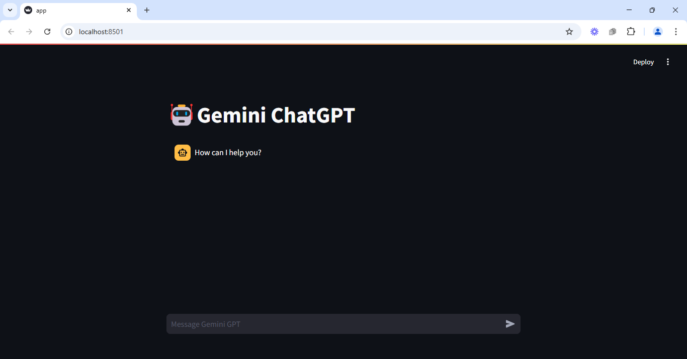
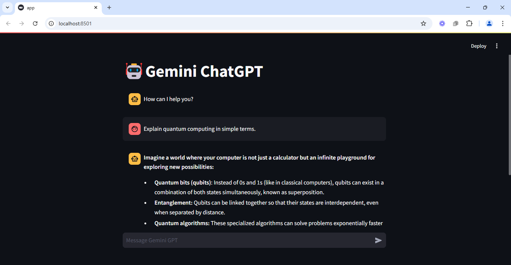

# 🤖 ChatGPT Lookalike: Streamlit + Google Gemini API  

Welcome to **ChatGPT Lookalike**, a lightweight and interactive chatbot application built with **Streamlit** and powered by the **Google Gemini API**. This project is a basic yet powerful conversational AI tool that allows users to ask any kind of query and get human-like responses in real-time.  

---

## 🚀 Features  
- **Real-time Chat**: Ask questions and get instant responses.  
- **Powered by Google Gemini**: Leverages advanced AI for accurate and engaging answers.  
- **Simple & Intuitive UI**: Built with Streamlit for a clean and user-friendly experience.  
- **Customizable**: Easy to extend and add new features.  

---

## 🛠️ Tech Stack  
- **Streamlit**: For building the interactive web app.  
- **Google Gemini API**: For natural language processing and response generation.  
- **Python**: The backbone of the application.  

---

## 📸 Screenshots  
*(Add screenshots of your app here)*  




---

## 🚀 Getting Started  

### Prerequisites  
- Python 3.8+  
- Streamlit (`pip install streamlit`)  
- Google Gemini API key (sign up [here](https://ai.google.dev/))  

### Installation  
1. Clone the repository:  
   ```bash  
   git clone https://github.com/your-username/chatgpt-lookalike.git  
   cd chatgpt-lookalike  
   ```  

2. Install dependencies:  
   ```bash  
   pip install -r requirements.txt  
   ```  

3. Set up your Google Gemini API key:  
   - Create a `.env` file in the root directory.  
   - Add your API key:  
     ```  
     GEMINI_API_KEY=your_api_key_here  
     ```  

4. Run the app:  
   ```bash  
   streamlit run app.py  
   ```  

5. Open your browser and navigate to `http://localhost:8501`.  

---

## � Usage  
- Type your query in the input box and hit Enter.  
- The app will display the AI-generated response instantly.  
- Ask anything—casual questions, factual queries, or even creative prompts!  

---

## 🛠️ Future Enhancements  
- Add voice input support 🎤  
- Enable multi-language responses 🌐  
- Integrate with other APIs for extended functionality 🔗  
- Improve UI/UX with custom themes and animations 🎨  

---

## 🤝 Contributing  
Contributions are welcome! If you have ideas for improvements or new features, feel free to:  
1. Fork the repository.  
2. Create a new branch (`git checkout -b feature/YourFeatureName`).  
3. Commit your changes (`git commit -m 'Add some feature'`).  
4. Push to the branch (`git push origin feature/YourFeatureName`).  
5. Open a pull request.  

---

## 📄 License  
This project is licensed under the MIT License. See the [LICENSE](LICENSE) file for details.  

---

## 🙏 Acknowledgments  
- **Streamlit** for making web app development a breeze.  
- **Google Gemini API** for powering the chatbot's intelligence.  
- The open-source community for endless inspiration and support.  

---

🌟 **Enjoy building and experimenting with your own ChatGPT lookalike!** 🌟  

*(End of README)*